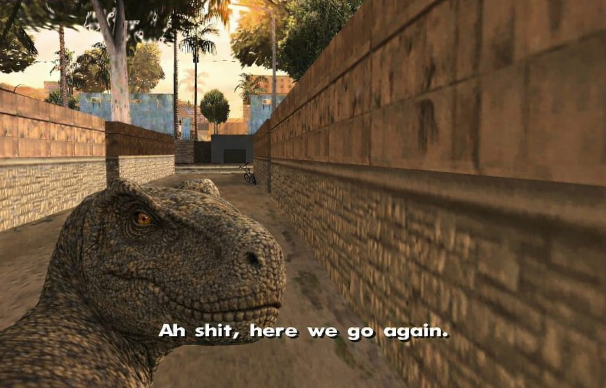

# FCSC 2026 Brontosaure

On vous demande d’écrire un keygen pour ce binaire et de le valider sur le service en ligne.

Auteur : Cryptanalyse

Origine : [Brontosaure](https://hackropole.fr/fr/challenges/reverse/fcsc2026-reverse-brontosaure/)

## Challenge
[files/brontosaure](files/brontosaure)

-----------

## Installation manuel
Vous n'utilisez pas l'application **les CTFs de Cyrhades** ? C'est dommage !
Mais voici comment installer ce CTF manuellement :

> git clone https://github.com/Hack-Oeil/fcsc2026-reverse-brontosaure.git

> cd fcsc2026-reverse-brontosaure

> docker compose -f docker-compose-default.yml up

-----------

## Sur le site officiel hackropole.fr
> https://hackropole.fr/fr/challenges/reverse/fcsc2026-reverse-brontosaure/
